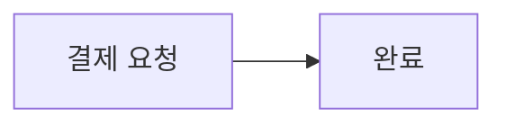
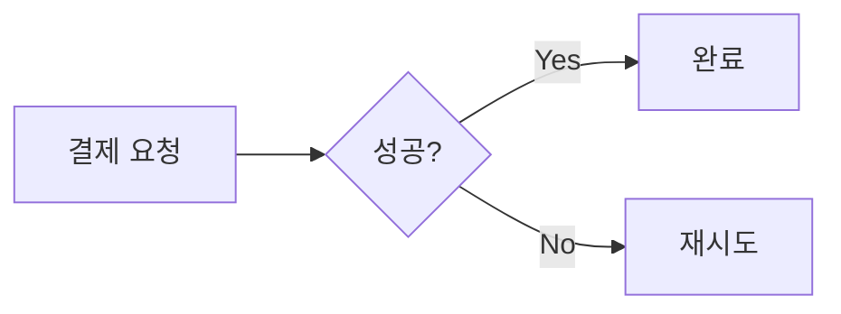
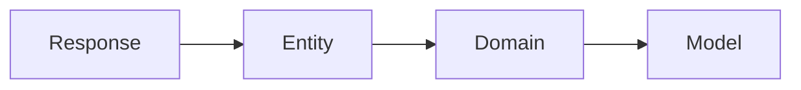
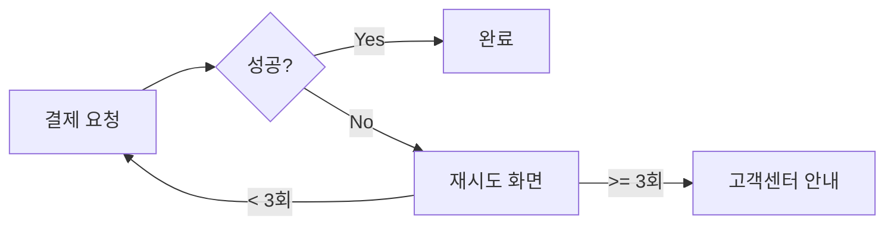

## Context

- Current branch: !`git branch --show-current`
- Remote URL: !`git remote get-url origin`

## Your task

### 0. 사전 검증
`git status`로 워킹 디렉토리 상태를 확인합니다.

- **커밋되지 않은 변경사항이 있는 경우**: 사용자에게 알리고 종료
  - "커밋되지 않은 변경사항이 있습니다. 먼저 커밋한 후 다시 PR 생성을 실행해주세요."
- **remote에 push되지 않은 커밋이 있는 경우** (`git ls-remote --heads origin <branch>`로 remote 브랜치 존재 확인 후, 있으면 `git log origin/<branch>..HEAD`, 없으면 신규 브랜치로 간주):
  - 확인 없이 `git push`를 실행한 후 계속 진행한다. (이 스킬에 진입한 것 자체가 push 동의를 의미하므로 별도로 묻지 않는다)

### 1. 기본 정보 추출
- 브랜치 이름에서 JIRA 티켓 ID 추출 (예: `feature/HDA-20017-*` → HDA-20017). 없으면 사용자에게 알리고 종료
- owner/repo는 `gh`가 현재 디렉토리의 origin remote로 자동 감지하므로 별도 추출하지 않는다

### 2. JIRA 티켓 조회
- `mcp__claude_ai_Atlassian__getAccessibleAtlassianResources`로 cloudId 가져오기
- `mcp__claude_ai_Atlassian__getJiraIssue`로 티켓 조회 (반드시 `fields: ["summary", "description", "parent"]` 명시)
- **인증 실패 시**: AskUserQuestion으로 반드시 사용자에게 확인
  - "예" → JIRA/에픽 조회 없이 develop을 base로 확정하고 3번 단계 건너뛰기
  - "아니오" → "'/mcp'로 JIRA를 재인증한 후 다시 '/pr'을 실행해주세요" 출력 후 종료

### 3. base 브랜치 결정

| 조건 | base |
|------|------|
| 사용자 지정 | 지정 브랜치 |
| JIRA 에픽 있음 | `git branch -r \| grep "origin/feature-base/{EPIC-KEY}"` 결과로 결정 (0개→develop, 1개→해당 브랜치, 여러개→사용자 선택) |
| 그 외 | develop |

### 4. PR 본문 작성

#### 작성 원칙 (필수)

- 마크다운 형식으로 작성한다.
- **기본 본문은 최소형이다.** 아래 두 섹션만 쓰고, 나머지(작업사항·다이어그램 등)는 "예외일 때만 추가"한다.

   ```markdown
   ## 개요
   <왜 이 변경이 필요한가 — 1~2문장>

   ## 관련 채널 내용
   <Jira 본문에서 추출한 링크 — 있을 때만>
   ```

- **개요는 1~2문장**으로 "왜 이 변경이 필요한가"만 적는다. 구현 방식·레이어·필드명은 본문에 적지 않는다.
- **템플릿에 없는 섹션을 임의로 만들지 않는다.** `## 기타`·`## 변경 이유` 등 AI가 덧붙이는 섹션은 금지.
- **커밋 메시지와 중복 금지**: 커밋 제목/메시지를 PR 본문에 나열하지 않는다. 리뷰어는 커밋 목록을 별도로 본다. PR 본문은 "커밋 히스토리로는 보이지 않는 맥락"만 담는다.
- **구어체로 작성**: PR 본문 문장은 `~합니다` 체로 작성한다. `~한다` 같은 평서형 문어체는 사용하지 않는다.
   - 예: `~ 문제를 해결한다.` → `~ 문제를 해결합니다.`
- **작업사항·mermaid는 예외일 때만 추가한다.** 기본은 생략. 추가 기준은 아래 "작업사항·mermaid 추가 기준" 참고. 애매하면 생략한다.
- **다른 Jira 이슈 언급 시 하이픈 제거**: PR 본문에서 현재 PR의 Jira 이슈가 아닌 **다른 Jira 이슈**를 참조할 때는 `HDA-xxxxx`가 아닌 `HDA xxxxx`(하이픈 대신 공백)로 작성한다. `HDA-xxxxx` 형식으로 쓰면 Jira가 해당 이슈에도 PR 상태를 자동 연동하기 때문이다. PR 제목과 본문 내 현재 Jira 이슈 표기는 기존대로 `HDA-xxxxx`를 유지한다.
   - 예: 현재 이슈가 `HDA-20017`이고 본문에 `HDA-19000`을 참조해야 하는 경우 → `HDA 19000`으로 작성

#### 작업사항·mermaid 추가 기준

`## 작업사항` 섹션은 **개요만으로 리뷰어가 변경 흐름을 이해할 수 없을 때만** 추가한다.

| 상황 | 본문 |
|------|------|
| 개요 1~2문장으로 충분 (단순 추가, DTO/레이어 배선, 이름 정리, 버그 픽스) | 작업사항 **생략** |
| 흐름이 있으나 글로 충분 | bullet 1~3개 |
| 화면/상태 전환·호출/데이터 흐름·모듈 구조 변경이 **리뷰의 핵심**이고 글로 설명이 어려움 | mermaid (`flowchart`/`stateDiagram`/`sequenceDiagram`/`classDiagram`) |

**애매하면 생략한다.** DTO/레이어 매핑처럼 기계적으로 자명한 흐름은 mermaid로 그리지 않는다.

#### before/after 비교

변경 전/후 구조나 흐름을 mermaid로 비교할 때는 **반드시 별도의 mermaid 블록 2개로 분리**하여 작성한다. 하나의 블록에 `subgraph`나 좌/우 배치로 합치지 않는다.

- 각 블록 위에 `**Before**`, `**After**` 헤더를 붙여 구분한다.
- Before/After 블록은 동일한 다이어그램 유형(flowchart/sequenceDiagram 등)과 동일한 방향(LR/TD 등)을 사용해 비교하기 쉽게 한다.

예시:

~~~markdown
**Before**



**After**


~~~

#### 좋은 예 / 나쁜 예

**나쁜 예 1** (커밋 메시지 나열, 장황, 중복):

```markdown
## 개요
HDA-20017 이슈에 따라 이용약관 버튼을 추가합니다. 사용자가 로그인 화면에서 이용약관을 확인할 수 있도록 버튼을 추가하고, 클릭 시 이용약관 화면으로 이동하도록 합니다. 또한 이용약관 화면에서 뒤로가기 시 로그인 화면으로 돌아오도록 합니다.

## 작업사항
- feat: 이용약관 버튼 추가
- feat: 이용약관 화면 네비게이션 추가
- refactor: LoginViewModel 정리
- test: 버튼 클릭 테스트 추가
```

**나쁜 예 2** (자명한 DTO/레이어 흐름을 mermaid로 그리고, 코드로 보이는 구현·범위를 `## 기타`로 덧붙임):

~~~markdown
## 개요
서버에 필터 API가 추가됨에 따라 앱이 두 필터 값을 주고받도록 API/DTO 레이어를 추가합니다.

## 작업사항


- 응답에서 옵션 목록을 받아 전 레이어로 전달합니다.

## 기타
- 서버 배포 전 nullable + 빈 목록 폴백으로 처리했습니다.
- 컴포넌트 이름 정리(AccidentType* → AccidentRepairsSummary*)뿐입니다.
~~~

**좋은 예 — 기본 (최소형)** — 위 "나쁜 예 2"를 이 형태로 줄인다:

```markdown
## 개요
API 변경사항을 반영합니다.

## 관련 채널 내용
https://...
```

**좋은 예 — 예외 (mermaid 사용)** — 화면/흐름/구조 변경이 리뷰의 핵심일 때만:

~~~markdown
## 개요
결제 실패 시 재시도 플로우가 없던 문제를 해결합니다. 재시도 3회 초과 시 고객센터 안내로 분기합니다.

## 작업사항


~~~

### 5. PR 생성
1. PR 템플릿 읽기 (`.github/PULL_REQUEST_TEMPLATE.md`)
2. JIRA 본문에서 링크 추출 (Figma, Slack 등)
3. 템플릿 섹션 채우기:
   - "## 개요": 4번 전략으로 작성 (필수)
   - "### 디자인 화면": Figma 링크 있을 때만
   - "### 관련 채널 내용": 관련 링크 있을 때만
   - "## 작업사항": 4번 "작업사항·mermaid 추가 기준"에 해당할 때만 추가 (기본 생략)
   - 비어있는 섹션은 제거
4. PR 본문을 임시 markdown 파일로 저장한다 (예: `/tmp/pr-body-{티켓ID}.md`).
   - 본문에 mermaid·백틱·대괄호가 포함되므로 `--body`에 인라인하지 않고 **반드시 `--body-file`로 전달**한다. (`--body "..."`에 백틱을 넣으면 셸 명령 치환으로 깨진다)
5. `gh pr create`로 PR을 생성한다:
   - `--title "{티켓ID} {JIRA summary}"` — **반드시 JIRA summary 필드 값을 그대로 사용** (요약/가공/의역 금지)
   - `--base {3번에서 결정한 브랜치}`
   - `--head {현재 브랜치}`
   - `--body-file {4번 임시 파일}`
   - `--assignee @me` — assignee를 본인으로 설정 (`gh`는 `@me`를 현재 인증 사용자로 해석)

## 예시

| 상황 | 브랜치 | base | PR 제목 |
|------|--------|------|---------|
| 에픽 있음 | feature/HDA-20017-agreement-button | feature-base/HDA-20000-agreement | HDA-20017 [고객][이용약관] 이용약관 버튼 추가 |
| 에픽 없음 | feature/HDA-20018-notification-fix | develop | HDA-20018 알림 버그 수정 |

## 중요
- 사용자 명시 요청 시 해당 내용 우선
- **JIRA 인증 실패 시 절대 임의 진행 금지 — 반드시 사용자에게 확인**
