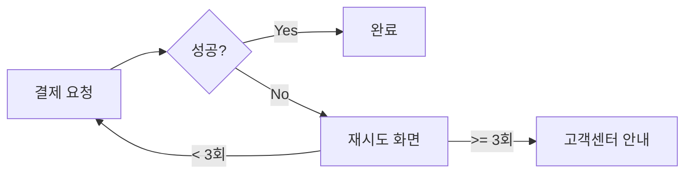

## Context

- Current branch: !`git branch --show-current`
- Remote URL: !`git remote get-url origin`

## Your task

### 0. 사전 검증
`git status`로 워킹 디렉토리 상태를 확인합니다.

- **커밋되지 않은 변경사항이 있는 경우**: 사용자에게 알리고 종료
  - "커밋되지 않은 변경사항이 있습니다. 먼저 커밋한 후 다시 PR 생성을 실행해주세요."
- **remote에 push되지 않은 커밋이 있는 경우** (`git ls-remote --heads origin <branch>`로 remote 브랜치 존재 확인 후, 있으면 `git log origin/<branch>..HEAD`, 없으면 신규 브랜치로 간주):
  - AskUserQuestion으로 "push되지 않은 커밋이 있습니다. push하고 PR을 작성할까요?" 확인
  - "예" → `git push` 실행 후 계속 진행
  - "아니오" → 종료

### 1. 기본 정보 추출
- git remote URL에서 owner/repo 추출
(예: `https://github.com/PRNDcompany/heydealer-android.git` → owner: PRNDcompany, repo: heydealer-android)
- 브랜치 이름에서 JIRA 티켓 ID 추출 (예: `feature/HDA-20017-*` → HDA-20017). 없으면 사용자에게 알리고 종료

### 2. JIRA 티켓 조회
- `mcp__atlassian__getAccessibleAtlassianResources`로 cloudId 가져오기
- `mcp__atlassian__getJiraIssue`로 티켓 조회 (반드시 `fields: ["summary", "description", "parent"]` 명시)
- **인증 실패 시**: AskUserQuestion으로 반드시 사용자에게 확인
  - "예" → JIRA/에픽 조회 없이 develop을 base로 확정하고 3번 단계 건너뛰기
  - "아니오" → "'/mcp'로 JIRA를 재인증한 후 다시 '/pr'을 실행해주세요" 출력 후 종료

### 3. base 브랜치 결정

| 조건 | base |
|------|------|
| 사용자 지정 | 지정 브랜치 |
| JIRA 에픽 있음 | `git branch -r \| grep "origin/feature-base/{EPIC-KEY}"` 결과로 결정 (0개→develop, 1개→해당 브랜치, 여러개→사용자 선택) |
| 그 외 | develop |

### 4. PR 본문 작성

`git log base..HEAD --pretty=format:"%H %s"`로 커밋 목록을, 필요 시 `git show <hash> --name-status --pretty=format:""`로 변경 파일을 확인한 뒤, 아래 원칙에 따라 작성한다.

> **⚠️ 마크다운 형식으로 작성한다.** 코드/클래스/파일명은 백틱, 목록은 `- ` 또는 `1. `.

#### 작성 원칙 (필수)

1. **간결함 우선**: 개요는 **1~3문장**, 작업사항은 **3~5 bullet**. 그 이상 쓰지 않는다.
2. **커밋 메시지와 중복 금지**: 커밋 제목/메시지를 PR 본문에 나열하지 않는다. 리뷰어는 커밋 목록을 별도로 본다. PR 본문은 "커밋 히스토리로는 보이지 않는 맥락"만 담는다.
3. **리뷰어 관점으로 요약**: "왜 이 PR이 필요한가"와 "리뷰어가 무엇에 집중해야 하는가"만 적는다. 세부 구현/변수명/함수 동작은 코드에서 보므로 본문에서 제외한다.
4. **복잡한 변경은 mermaid로**: 아래 조건에 해당하면 텍스트 설명 대신 mermaid 다이어그램을 넣는다.

#### mermaid 사용 기준

| 변경 유형 | 다이어그램 |
|----------|-----------|
| 화면/상태 전환 추가·변경 | `flowchart` 또는 `stateDiagram` |
| 호출/데이터 흐름 변경 | `sequenceDiagram` |
| 모듈/클래스 구조 변경 | `flowchart` 또는 `classDiagram` |

단순 변경(버그 픽스, 단일 함수 수정, 문구/스타일 변경 등)에는 mermaid를 **사용하지 않는다**.

#### 정보 원천

- **JIRA description이 충분한 경우**: 개요는 JIRA summary/문제 배경에서, 작업사항은 description의 핵심(API 스펙, 필드 정의 등)만 추출. description을 그대로 복사하지 말고 **PR 스코프에 해당하는 항목만** 남긴다.
- **JIRA 없음/부족**: 변경 파일 목록을 보고 리뷰어 관점으로 요약. 커밋 메시지 복사 금지.

#### 좋은 예 / 나쁜 예

**나쁜 예** (커밋 메시지 나열, 장황, 중복):

```markdown
## 개요
HDA-20017 이슈에 따라 이용약관 버튼을 추가합니다. 사용자가 로그인 화면에서 이용약관을 확인할 수 있도록 버튼을 추가하고, 클릭 시 이용약관 화면으로 이동하도록 합니다. 또한 이용약관 화면에서 뒤로가기 시 로그인 화면으로 돌아오도록 합니다.

## 작업사항
- feat: 이용약관 버튼 추가
- feat: 이용약관 화면 네비게이션 추가
- refactor: LoginViewModel 정리
- test: 버튼 클릭 테스트 추가
```

**좋은 예** (간결, 커밋과 비중복, 맥락 중심):

```markdown
## 개요
로그인 화면에 이용약관 진입점이 없어 PG사 심사 요건을 충족하지 못하는 문제를 해결한다.

## 작업사항
- 로그인 화면에 이용약관 버튼 추가 및 기존 약관 화면으로 라우팅
- 약관 화면에서 뒤로가기 시 로그인 화면 복귀 (`popBackStack` 동작 확인 필요)
```

**mermaid 예** (화면 전환 추가):

~~~markdown
## 개요
결제 실패 시 재시도 플로우가 없던 문제를 해결한다. 재시도 3회 초과 시 고객센터 안내로 분기.

## 작업사항
- 결제 실패 후 재시도 화면 추가
- 실패 횟수 누적 및 임계치 초과 시 분기 처리


~~~

### 5. PR 생성
1. PR 템플릿 읽기 (`.github/PULL_REQUEST_TEMPLATE.md`)
2. JIRA 본문에서 링크 추출 (Figma, Slack 등)
3. 템플릿 섹션 채우기:
   - "## 개요": 4번 전략으로 작성 (필수)
   - "### 디자인 화면": Figma 링크 있을 때만
   - "### 관련 채널 내용": 관련 링크 있을 때만
   - "## 작업사항": 4번 전략으로 작성 (필수)
   - 비어있는 섹션은 제거
4. `mcp__github__create_pull_request` 호출:
   - title: `{티켓ID} {JIRA summary}` — **반드시 JIRA summary 필드 값을 그대로 사용** (요약/가공/의역 금지). JIRA 없을 때만 커밋 기반으로 작성
   - head: 현재 브랜치, base: 3번 결정 브랜치

## 예시

| 상황 | 브랜치 | base | PR 제목 |
|------|--------|------|---------|
| 에픽 있음 | feature/HDA-20017-agreement-button | feature-base/HDA-20000-agreement | HDA-20017 [고객][이용약관] 이용약관 버튼 추가 |
| 에픽 없음 | feature/HDA-20018-notification-fix | develop | HDA-20018 알림 버그 수정 |

## 중요
- 사용자 명시 요청 시 해당 내용 우선
- **JIRA 인증 실패 시 절대 임의 진행 금지 — 반드시 사용자에게 확인**
