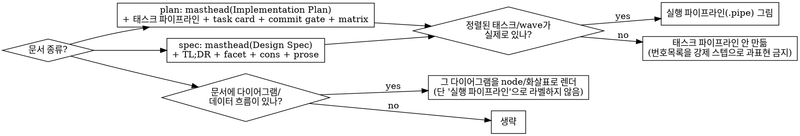

# publish-spec-plan-as-artifact

## Overview

spec/plan markdown 원본을 **고정 디자인 시스템**으로 렌더해 읽기 좋은 **published Claude Artifact**로 만든다. 로컬 `.md`가 source of truth, 아티팩트는 디자인된 뷰. raw markdown 발행이 아니다.

**아티팩트 = `design-system.md`의 고정 CSS/토큰 (그대로 인라인) + 문서 내용을 매핑한 컴포넌트.** 룩(팔레트·폰트·컴포넌트)은 고정, 콘텐츠 구조만 문서에 맞춰 적응(하이브리드). **팔레트·폰트를 새로 디자인하지 않는다** — 자유 디자인은 cliché(cream+테라코타, indigo+teal 등)로 수렴하고 문서 간 일관성이 깨진다.

## When to use

- brainstorming에서 spec이 사용자 승인된 직후 (자동)
- writing-plans에서 plan이 사용자 리뷰 통과한 직후 (자동)
- 명시 요청: "아티팩트로 발행", "가독성 좋게"

**When NOT:** 임의 웹페이지, `.agent/` 밖 일반 markdown(명시 요청 없으면), raw md 그대로 발행.

## Decision: 무엇을 그릴지

구조 적응에서 틀리기 쉬운 지점. 아래대로 판단한다.

**핵심**: 문서에 **이미 있는** 다이어그램을 시각화하는 것(좋음)과, 정렬된 태스크가 없는데 **태스크 파이프라인을 날조**하는 것(금지)은 다르다.

## Workflow

1. **대상 `.md` 확정 확인** — 승인/최종 상태. 로컬 파일이 원본이며 계속 유지한다.
2. **종류 판별** — 경로/제목으로 `spec`(`.agent/specs/`) 또는 `plan`(`.agent/plans/`).
3. **REQUIRED: `design-system.md`를 Read** (이 스킬 디렉토리). CSS·JS·골격·컴포넌트·적응 규칙·발행 규약이 전부 거기 있다.
4. **파싱 → 매핑** — Quick Reference대로 문서 요소를 컴포넌트에 매핑하고 위 Decision을 적용한다. 내용은 **실제 문서에서** 가져온다(lorem/요약 날조 금지).
5. **HTML 조립** — 골격 + `design-system.md`의 `<style>`/`<script>`를 **그대로** 인라인 + 채운 컴포넌트. 코드블록의 `<` `>` `&`는 이스케이프. `<!doctype>`/`<html>`/`<head>`/`<body>` 태그는 넣지 않는다(Artifact가 감쌈).
6. **scratchpad에 `.html` write.**
7. **발행** — `.md` 최상단에 `<!-- artifact: URL -->`가 있으면 `Artifact(url=그 URL)`로 같은 페이지 갱신, 없으면 신규 발행. `title`·`favicon`·`description`은 발행 규약(design-system §6) 준수, 재발행 시 `title`·`favicon` 고정. private 유지(공유 링크 전환은 명시 요청 시만).
8. **URL 기록** — 신규 발행이면 반환 URL을 `.md` 최상단에 `<!-- artifact: URL -->`로 기록(별도 커밋 대상).
9. **출력** — 응답에 로컬 절대경로 + 아티팩트 URL을 각각 별도 라인으로.

## Quick Reference

문서 요소 → 컴포넌트 (상세 HTML은 `design-system.md` §4):

| 문서 요소 | 컴포넌트 |
|---|---|
| 제목 + Goal 리드 | `masthead` + eyebrow(`Design Spec`/`Implementation Plan`) + `chips` |
| TL;DR (문제/해결/범위밖) | `.tldr` dl |
| Goal · Architecture · 핵심 제약 | `.grid-3 .facet` |
| Global Constraints | `.cons` |
| **정렬된 태스크/wave** (주로 plan) | `.pipe`(실행 파이프라인) + `.wave-head` + `.task--*` + `.commit` |
| **문서 내 다이어그램·데이터 흐름** | `.pipe`/node 재사용해 시각 렌더 (실행 파이프라인 라벨 X) |
| Self-Review 커버리지 | `.matrix` |
| 미해결/리스크 | `.risk` |

- **plan**: 태스크 파이프라인 + task card + commit gate + matrix 중심.
- **spec**: facet/cons/prose 중심. **정렬된 태스크가 없으면 태스크 파이프라인·커밋 게이트 없음.** 단 데이터 흐름 다이어그램은 렌더한다.

## Common mistakes

| 실수 | 교정 |
|------|------|
| 팔레트·폰트를 새로 디자인 | `design-system.md`의 고정 토큰/CSS를 **그대로** 인라인. 새 팔레트 금지(cliché로 샘). |
| raw md를 그대로 Artifact에 넘김 | 컴포넌트로 매핑해 렌더. 원본 md는 소스일 뿐. |
| spec에 없는 **태스크 파이프라인 날조** | 정렬된 태스크가 있을 때만 `.pipe` 실행 파이프라인. 없으면 안 만듦. 번호목록을 강제 스텝으로 과표현 X. |
| 문서에 있는 다이어그램을 평문 덤프 | 데이터 흐름·다이어그램은 node/화살표로 시각 렌더(단 "실행 파이프라인" 라벨 아님). |
| 재발행 때 `title`/`favicon` 변경 | 고정 — 사용자가 같은 문서로 인지. |
| 새 세션에서 `url=` 없이 재발행 | dupe 발생 — `.md`의 `<!-- artifact: URL -->`를 `url=`로 넘김. |
| 코드 `<`/`>`/`&` 미이스케이프 | 이스케이프(대개 잘 되나 `List<String>` 등 확인). |
